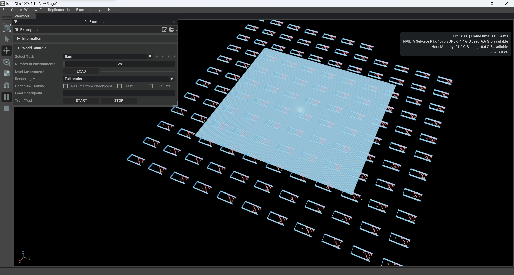

# Omniverse Isaac Gym Environment for BARN Challenge

## About this repository

This repository replants the [BARN Challenge Environment](https://github.com/Daffan/the-barn-challenge) into the [Omniverse Isaac Gym Environment](https://github.com/NVIDIA-Omniverse/OmniIsaacGymEnvs) for reinforcement learning. 

*Also see [The BARN Challenge](https://cs.gmu.edu/~xiao/Research/BARN_Challenge/BARN_Challenge24.html).*

Based on our test, our PC (13700KF CPU, 64GB RAM, 4070 Super GPU with 12GB VRAM) can run 64 environments in parallel in real-time.




## How to run

### Installation

1. Follow the [instruction](https://github.com/NVIDIA-Omniverse/OmniIsaacGymEnvs?tab=readme-ov-file#installation) of the original repository to install the Omniverse Isaac Gym Environment. Note that the repository url `https://github.com/NVIDIA-Omniverse/OmniIsaacGymEnvs.git` should be changed to `https://github.com/Skythinker616/BarnOIGE.git`.

2. Add sensor plugin to kit dependencies list.

    ```text
    "omni.isaac.sensor" = {}
    ```

    Add the above line at the end of `omni.isaac.sim.python.gym.kit`, `omni.isaac.sim.python.gym.headless.kit` and `omni.isaac.sim.gym.kit` in `<isaac_sim_root>/apps` directory.

3. Place the Lidar configuration file `barn_utils/lidar/OS1_32ch20hz512res.json` in `<isaac_sim_root>/exts/omni.isaac.sensor/data/lidar_configs/Ouster` directory.

### Run with default rl_games script

Same as the original repository, you can run the training script with task name `Barn`:

```bash
PYTHON_PATH scripts/rlgames_train.py task=Barn
```

### Run with extension workflow

Run following command to start isaac gym:

```bash
<isaac_sim_root>/isaac-sim.gym.sh --ext-folder </parent/directory/to/this/repo>
```

The UI window can be activated from Isaac Examples > RL Examples by navigating the top menu bar. For more details on the extension workflow, please refer to the [documentation](https://github.com/NVIDIA-Omniverse/OmniIsaacGymEnvs/blob/main/docs/framework/extension_workflow.md).

### Run with [skrl](https://skrl.readthedocs.io/)

1. Install skrl:

    ```bash
    PYTHON_PATH -m pip install skrl["torch"]
    ```

2. Run the example script in this repository:

    ```bash
    PYTHON_PATH scripts/barn_skrl_td3.py
    ```

3. Other skrl examples can be found [here](https://github.com/Toni-SM/skrl/tree/main/docs/source/examples/omniisaacgym).


> Note 1: All commands above should be executed from `BarnOIGE/omniisaacgymenvs`.
>
> Note 2: `<isaac_sim_root>` is the root directory of Isaac Sim package, which is the directory containing `python.bat` or `python.sh`.
>
> Note 3: This project only tested on Windows 11, if you encounter any problem on other platforms, please create an issue.

## Convert BARN Challenge .world files to Isaac Gym .usd files

> Note: This step is optional. The converted 300 .usd files are already included in this repository under `barn_utils/usd/worlds`.

1. Build [gz-usd](https://github.com/gazebosim/gz-usd) following its instruction. (We used WSL to build it on Windows.)

2. Place the `barn_utils/scripts/batch_convert.sh` in the `./build/bin` directory of gz-usd (path to executable `sdf2usd`).

3. Run the script with the path to the BARN Challenge .world files directory:

    ```bash
    bash batch_convert.sh </parent/directory/to/world_files>
    ```

4. Run Isaac Sim and open its Script Editor (Window > Script Editor). Copy and run the content of `barn_utils/scripts/clean_usd.py` in the Script Editor to clean the converted .usd files.
